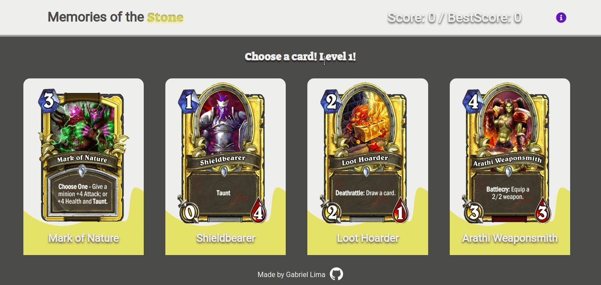

# Memory of the Stone
It's a memory game that test your memorization capabilities, using HearthStone cards.<br/>
So every time you click a card the deck shuffle and you have to click a card that you don't clicked yet.<br />
This game has 5 level and every level adds new cards. When you level up the amount of cards change, the new number will be (last level number of cards) + 4.<br />
This way the max score is 60pts.<br />
This application was build with React using function components and hooks, so this project has a pretty good use of useState and useEffect in its code.
Furthermore I use HearthStone API to fetch the cards data.

## Demo
 <br />
If you want to give it a try click the link below: <br />
[Live Demo](https://gabriellima77.github.io/memory_of_the_stone/)

## Getting started
If you want to use this app locally, follow the steps below:<br />
```
git clone git@github.com:gabriellima77/memory_of_the_stone.git
cd memory_of_the_stone
npm install
npm start
```

## Built with
- [React](https://reactjs.org/)
- [HearthStoneAPI](https://hearthstoneapi.com/)
